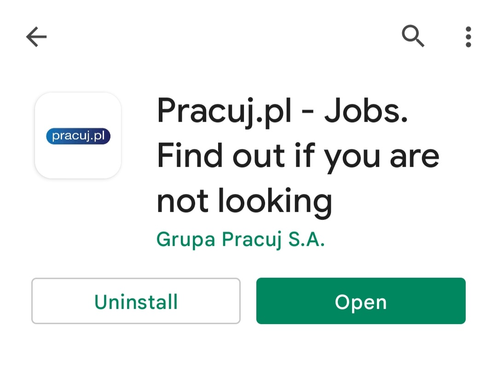

Sample document
===============

<!-- Here comes the TOC -->
Table of content

1. [Sample document](#sample-document)
2. [Header of chapter](#header-of-chapter)
3. [Header of another chapter](#header-of-another-chapter)
   1. [Chapter](#chapter)
   2. [Another chapter](#another-chapter)
      1. [Lower level chapter](#lower-level-chapter)
4. [One more header of chapter](#one-more-header-of-chapter)
5. [New header](#new-header)
   1. [Sub-header](#sub-header)
   2. [Second sub-header](#second-sub-header)
6. [Pracuj.pl: User Manual](#pracujpl-user-manual)
   1. [Introduction](#introduction)
   2. [Application Quickstart Guide](#application-quickstart-guide)
      1. [How to download the **Pracuj.pl app**?](#how-to-download-the-pracujpl-app)
      2. [First steps](#first-steps)

<!-- Chapters with headers -->
# Header of chapter
This is a paragraph of text. This is a paragraph of text. This is a paragraph of text. This is a paragraph of text. This is a paragraph of text.
# Header of another chapter
This is a paragraph of text. This is a paragraph of text. This is a paragraph of text. This is a paragraph of text. This is a paragraph of text.
## Chapter
Chapter text.
## Another chapter
More chapter text.
### Lower level chapter
Bla bla!
# One more header of chapter
This is a paragraph of text. This is a paragraph of text. This is a paragraph of text. This is a paragraph of text. This is a paragraph of text.
Some text.
# New header
There must be some kind of way out of here
## Sub-header
Said a joker to the thief
## Second sub-header
There's so much confusion, I just can't get no relief :(

# Pracuj.pl: User Manual
## Introduction
Are you a foreigner looking for a job in Poland? If you are new here or still have problems with the Polish language (understandable, as it is one of the hardest in the world!), you might be searching for work on international platforms, such as [LinkedIn](https://www.linkedin.com/) or [Glassdoor](https://www.glassdoor.com/index.htm).

However, it is always a good idea to go local: that way, you can broaden your search and increase your chances of landing a better position. This user-friendly guide will help you to quickly install and use the application provided by [Pracuj.pl](https://www.pracuj.pl) – one of the biggest national platforms with job offers, available only in Polish.
## Application Quickstart Guide
This Quickstart Guide will walk you through the basic functions of the **Pracuj.pl app**: downloading the app, installing it on your device and searching for a job without creating an account.

If you wish to create an account and learn about the more advanced functions of the **Pracuj.pl app**, such as applying for jobs, go to the more detailed User Guide.

### How to download the **Pracuj.pl app**?
Depending on the device that you use, you can download the app from:
* [GooglePlay](https://play.google.com/store/apps/details?id=pl.pracuj.android.jobsearcher&shortlink=51679bb6&pid=autopromo&c=autopromo_stopka_sg): for Android and Chrome OS devices;
* [AppStore](https://apps.apple.com/PL/app/id386774884?mt=8&shortlink=c3bc3623&pid=autopromo&c=autopromo_stopka&af_dp=https%3A%2F%2Fapps.apple.com%2Fpl%2Fapp%2Fid386774884): for iOS devices,
* [HUAWEIAppGallery](https://appgallery.huawei.com/#/app/C100957085?channelId=EUPLBDD20200805PR&detailType=0): for HUAWEI devices.

Let's look at the installation process when using an Android device. After entering [GooglePlay](https://play.google.com/store/apps/details?id=pl.pracuj.android.jobsearcher&shortlink=51679bb6&pid=autopromo&c=autopromo_stopka_sg), you should see the following screen:

Click on **install**. Then, you should see these options:

### First steps
