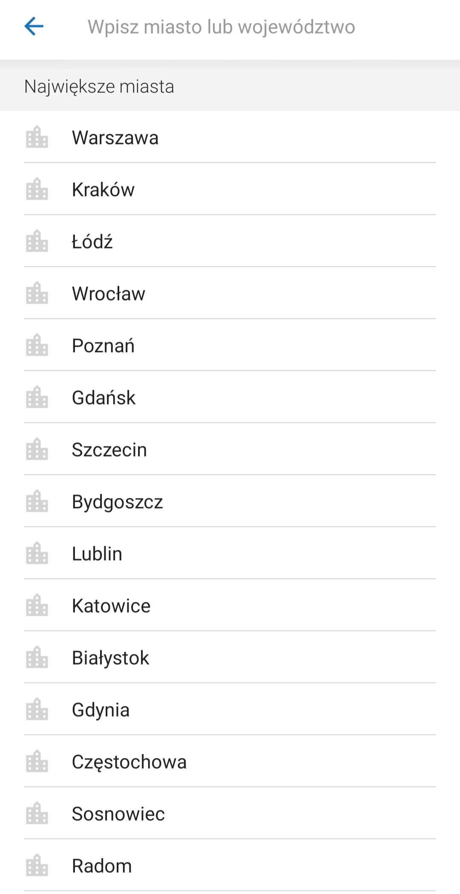
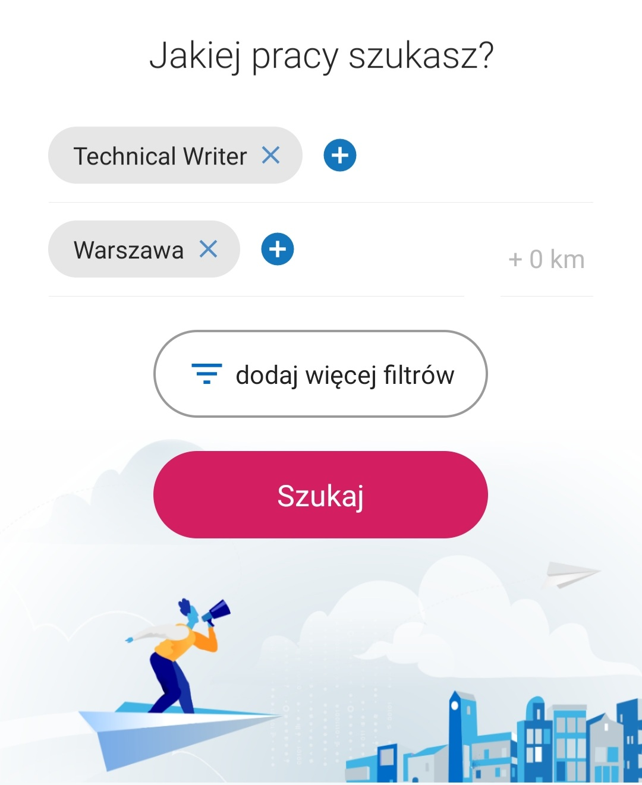

**Table of contents**

1. [Introduction](#introduction)
2. [Application Quickstart Guide](#application-quickstart-guide)
   1. [Downloading and installing the app](#downloading-and-installing-the-app)
   2. [Entering the app](#entering-the-app)
   3. [Searching for a job](#searching-for-a-job)
      1. [By keyword](#by-keyword)
      2. [By location](#by-location)
3. [User Guide](#user-guide)

# Pracuj.pl: User Manual <!-- omit in toc -->
## Introduction
Are you a foreigner looking for a job in Poland? If you are new here or still have problems with the Polish language (understandable, as it is one of the hardest in the world!), you might be searching for work on international platforms, such as [LinkedIn](https://www.linkedin.com/) or [Glassdoor](https://www.glassdoor.com/index.htm).

However, it is always a good idea to go local: that way, you can broaden your search and increase your chances of landing a better position. This user-friendly guide will help you to quickly install and use the application provided by [Pracuj.pl](https://www.pracuj.pl) – one of the biggest national platforms with job offers, available only in Polish.
## Application Quickstart Guide
First, let's learn how to **download, install** and **discover the basic features** of the **Pracuj.pl app**. Without creating an account, you will be able to browse jobs by:

* key words,
* location,
* category.

**Creating an account** gives you a lot more possibilities. This useful feature allows you to:
* save job offers, 
* apply for jobs,
* create your own documents, such as CVs and cover letters.
  
If you wish to **create an account** and explore the advanced functions of the **Pracuj.pl app**, refer to our complete [User Guide](#user-guide)  (in preparation).

For terminology

### Downloading and installing the app
Depending on the device that you use, you can download the **Pracuj.pl app** from:
* [GooglePlay](https://play.google.com/store/apps/details?id=pl.pracuj.android.jobsearcher&shortlink=51679bb6&pid=autopromo&c=autopromo_stopka_sg): for Android and Chrome OS devices;
* [AppStore](https://apps.apple.com/PL/app/id386774884?mt=8&shortlink=c3bc3623&pid=autopromo&c=autopromo_stopka&af_dp=https%3A%2F%2Fapps.apple.com%2Fpl%2Fapp%2Fid386774884): for iOS devices,
* [HUAWEIAppGallery](https://appgallery.huawei.com/#/app/C100957085?channelId=EUPLBDD20200805PR&detailType=0): for HUAWEI devices.

This is the installation process when using an Android device. After entering [GooglePlay](https://play.google.com/store/apps/details?id=pl.pracuj.android.jobsearcher&shortlink=51679bb6&pid=autopromo&c=autopromo_stopka_sg), you should see the following screen:

Click on *install*. Then, you should see these options:

Click on *open*.

### Entering the app

The application is ready to be used! Your screen should now look like this:

Let's skip the login and register options and click directly on *Pomiń* (*skip*). The following search options and categories will appear on your screen:

### Searching for a job
#### By keyword
If you are looking for a new job, you certainly have a position that you are qualified for or simply interested in. Or maybe there is this one company that has caught your attention? This is where the *stanowisko lub firma* (*position or company*) field comes in. Here, you can enter a job name (for example: Product Owner, Technical Writer, FrontEnd Developer), a company name (Capgemini, Microsoft, Atlassian, etc.) or even a particular job skill (French, Spanish, Java, Jira). You can also combine the keywords and type more than one. However, try not to be too specific: typing too many keywords limits the number of available job offers.

**Important tip:** employers who use the **Pracuj.pl app** very often publish in English. So, you don't need to speak Polish to use the search feature!

#### By location
Do you already live in a great city? Are you looking to move to a place that offers more opportunities? In both cases, you can use the *miasto lub województwo* (*city or voivodeship*) field. It allows you search for a job in your preferred location: either by city or voivodeship (a Polish administrative region). After tapping it, you will see the list of the biggest Polish cities. You can either choose one of the given options or type your own:

After choosing your location, you can also broaden your search by defining the preferred distance from it. This is the screen after searching for a job position **Technical Writer** in the city of **Warsaw**:

## User Guide
